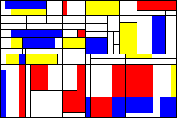

[](https://travis-ci.org/8lall0/GoMondrian) [](https://opensource.org/licenses/MIT)

# GoMondrian

A simple Piet Mondrian-like generator written in golang.



## Getting Started

### Prerequisites

You need a working Go installation. (1.7 or greater)

### Installing

```
$ go get github.com/8lall0/GoMondrian
```

### How it works

It starts with an integer matrix filled with zeroes.
Then it randomly select a cell (pixel) and checks about:

* Borders (they must be not reachable from pixel plus surrounding padding)
* Paddings (they must not reach other preesistent borders)

Then it goes straight on rows or columns (settings cells to 1): if both are possible, it randomly selects one road.

If you reach another border, it randomly selects if go across and "divide" another square.

After that, it randomly fills some squares with a number from 2 to 4 to select different colors.

## Contributing

Feel free to send pull requests, fork or send me suggestions.

## Authors

* **Savino Pio Liguori**

## License

This project is licensed under the MIT License - see the [LICENSE.md](LICENSE.md) file for details

## Acknowledgments

* Strongly inspired by the work of [FogleMan](https://github.com/fogleman/Piet)
