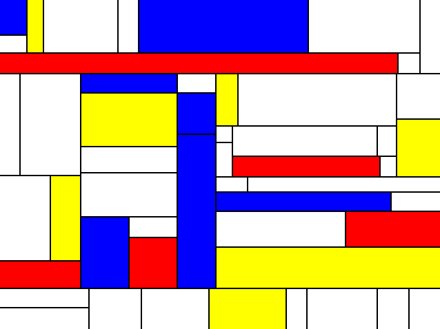

[](https://travis-ci.org/8lall0/GoMondrian)

# GoMondrian

A simple Piet Mondrian-like generator written in golang.



## Getting Started

### Prerequisites

You need a working Go installation. (1.7 or greater)

### Installing

```
$ go get github.com/8lall0/GoMondrian
```

### How it works

It select a random pixel onto an integer matrix with initial value of zero.

Then you check conditions about
* Borders
* Paddings
* Goes straight on rows or columns and then if you want to "divide" a preesistent square.

## Contributing

Feel free to send pull requests, fork or send me suggestions.

## Authors

* **Savino Pio Liguori**

## License

This project is licensed under the MIT License - see the [LICENSE.md](LICENSE.md) file for details

## Acknowledgments

* Strongly inspired by the work of [FogleMan](https://github.com/fogleman/Piet)
